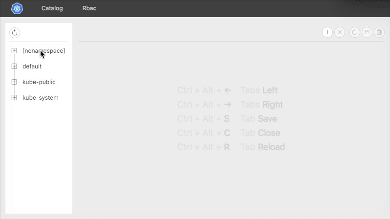
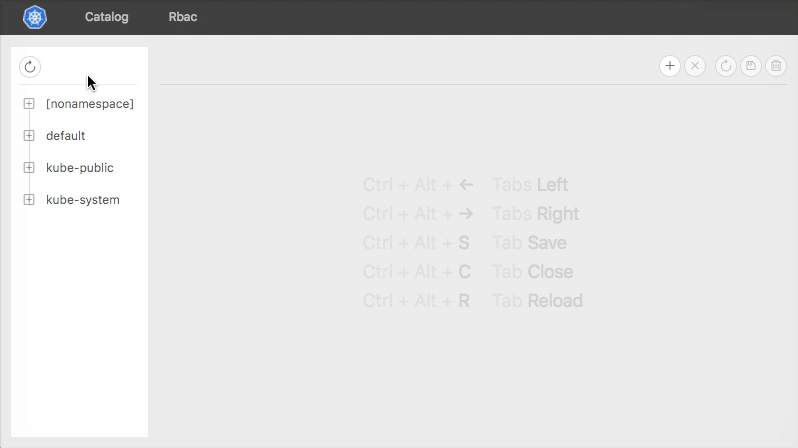
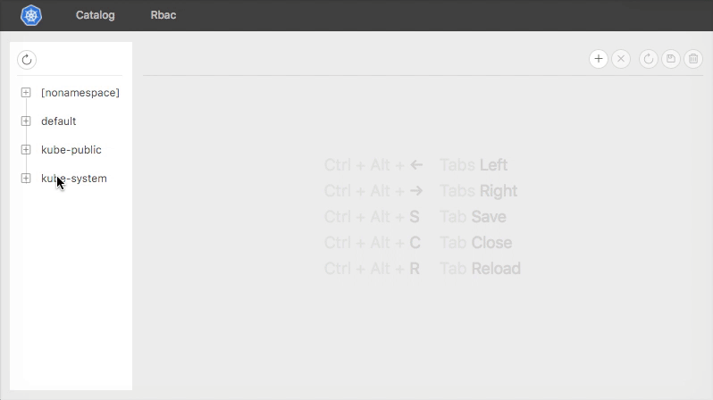

# Kubernator &nbsp; [](https://twitter.com/intent/tweet?text=Wow:&url=https%3A%2F%2Fgithub.com%2Fsmpio%2Fkubernator)

[](https://hub.docker.com/r/smpio/kubernator/)
[](https://github.com/smpio/kubernator)
[](https://github.com/smpio/kubernator)
[](https://github.com/smpio/kubernator)
[](https://github.com/smpio/kubernator)
[](https://github.com/smpio/kubernator/blob/master/LICENSE)

Although `kubectl` is a recommended way of running commands against Kubernetes clusters, it's just a command line tool, which lacks visual control and general convenience when working with YAML configs. `Kubernator` is an alternative [Kubernetes](https://kubernetes.io/) UI, which is built on top of `kubectl`'s API and offers simple yet powerful graphical interface: it gives you a clean view on *all* objects in your cluster with ability to edit, resolve conflicts and create new objects.


## Table of Contents

- [Features](#features)
  - [Catalog](#catalog)
    - [Navigation Tree](#navigation-tree)
    - [Caching](#caching)
    - [Multiple API Versions](#multiple-api-versions)
    - [Tabs](#tabs)
    - [Swagger Schemas](#swagger-schemas)
    - [Actions Bar](#actions-bar)
    - [Keyboard Shortcuts](#keyboard-shortcuts)
    - [Diff Editor](#diff-editor)
  - [Rbac](#rbac)
    - [Controls](#controls)
    - [Graph](#graph)
  - [Notifications](#notifications)
- [Getting Started](#getting-started)
  - [Install on Cluster](#install-on-cluster-recommended)
  - [Run in Docker Locally](#run-in-docker-locally)
  - [Build and Run Locally](#build-and-run-locally)
- [Support](#support)

## Features

### Catalog

Catalog offers an intuitive interface for managing `Groups`, `Resources` and `Items` through the `kubectl` API instead of using console commands. Resource items can be created, compared, modified and removed using a powerful diff editor.

#### Navigation Tree

Navigation tree shows resources, grouped by namespaces, and resource items inside. All API groups are fetched, which yields a list of versions and endpoints for every group. Then for all groups and versions `Kubernator` loads resources list, and then ― list of items for every known resource. To show the tree, resources are grouped by their namespaces. Navigation has its own actions bar, which currently consists from one action ― reload namespaces.



#### Caching

`Kubernator` fires a lot of API calls, that's why it actively caches their responses in browser's local storage to boost loading times in subsequent uses, e.g. API groups and Swagger schemas are reloaded only when `kubectl` updates. Resources reload every time the corresponding tree node is being opened. And items are reloaded again when opened in editor.

#### Multiple API Versions

Every group fetches its resources using all API versions, not only the preferred one, and then merges given resources into one list considering versions priority. It means we can access items through different API versions. Moreover, for a new item, an API endpoint will be choosed automatically based on the value of `apiVersion` field in its description.



#### Tabs

Tab names reflect current item's position in the navigation tree (resource namespace → resource kind → item). New items have green tab color, modified and not submitted items ― red tab color. Local modifications are saved even if the tab was closed and reopened again.



#### Swagger Schemas

When a new item is being created based on the currently opened one, all unnecessary and read-only fields are automatically stripped as described in the corresponding Swagger scheme.


#### Actions Bar

Available actions: open a new tab based on currently active one; close all tabs; reload, save or delete current item; switch currently active tab to the left/right neighbour.


#### Keyboard Shortcuts

Most frequent actions have associated keyboard shortcuts.


#### Diff Editor

Diff editor is based on the powerful [Monaco Editor](https://microsoft.github.io/monaco-editor/). Cursor position, scroll position and not applied updates are saved automatically for every open tab.


### Rbac

Rbac shows `Roles`, `ClusterRoles`, `RoleBindings`, `ClusterRoleBindings` and relationships between them in a visually intuitive way.

#### Controls

Simple controls pane allows to show/hide a legend, isolated nodes and extended names.


#### Graph

Graph area (built with the awesome `d3` library) shows an interactive force graph of linked nodes. The graph can be paned, dragged and zoomed. Nodes are draggable too, and links also show some additional information when hovered.


### Notifications

Every error and warning shows itself in a floating message on the right top side of the window. Errors are red and don't vanish automatically as warnings do. An example of concurrent edits of the same item:


## Getting started

There are many ways to run `Kubernator`:

### Install on cluster (recommended)

After installation you will have access to Kubernator just by running `kubectl proxy`. You won't have to run anything else locally. To install, run the following commands:

```sh
kubectl create ns kubernator
kubectl -n kubernator run --image=smpio/kubernator --port=80 kubernator
kubectl -n kubernator expose deploy kubernator
kubectl proxy
```

Then open [service proxy URL](http://localhost:8001/api/v1/namespaces/kubernator/services/kubernator/proxy/) in your browser.

### Run in docker locally

1. Exec `docker run -d --name=kubernator -p 3000:80 smpio/kubernator`

2. Run `kubectl proxy`.

3. Open [http://localhost:8001/](http://localhost:8001/) in your browser.

### Build and run locally

1. Install and [set up](https://kubernetes.io/docs/tasks/tools/install-kubectl/) `kubectl`  

2. Clone and build `Kubernator`:

    ```sh
    yarn install && yarn build
    ```

3. Run Kubernetes API server:

    ```sh
    kubectl proxy
    ```
4. Update `proxy` value in `package.json` according to the previous command's output.

5. Run `Kubernator`:

    ```sh
    yarn start
    ```

### Desktop app

Coming soon.

## Support

Please [open an issue](https://github.com/smpio/kubernator/issues/new) for support.

Please contribute using [Github Flow](https://guides.github.com/introduction/flow/). Create a branch, add commits, and [open a pull request](https://github.com/smpio/kubernator/compare/).

MIT License
